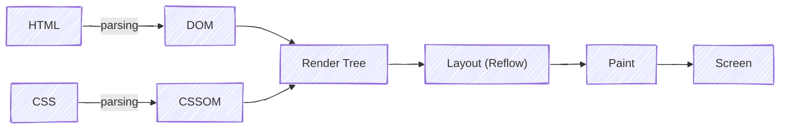

## Prerequisites

1. HTML + CSS Basics
2. JavaScript Basics
3. Testosterone > 300 ng/dL

## Introduction

Web browser is a complex and interesting application. It does many things, including networking, playing video & audio, rendering, compiling JavaScript, and more.

In this blog, I'm covering the rendering part, specifically how browsers render HTML pages, CSS, parsing, reflow, repaint, and layout.

### High Level view



## HTML parsing -> DOM

The browser receives an HTML file from the network/server, then the raw file/Bytes -> Characters, Token -> Node -> DOM.

script, link and style tags will halt the parser as script can alter the document, so the browser waits for it. That's why we should put the script tag at the bottom so the main content appears first.

We write HTML, but under the hood, it's C and C++.

<br>

**Example**

```HTML
<div>
  <p>Hello</p>
</div>
```

<p class="pt-2">Becomes a tree:</p>

```
Document
 └─ div
     └─ p
        └─"Hello"
```

## CSS parsing -> CSSOM

Same as the HTML, CSS files and style blocks are parsed.

CSS parsing is blocking for rendering because the browser must know “What styles apply to each element?” Before it can calculate the layout or paint anything.

JS execution will be halted until CSSOM is ready.

## DOM + CSSOM → Render Tree

This is the actual representation that will be visible on screen, which means it only contains visible elements(head, meta, script are excluded).

This is where CSS cascade, inheritance, and specificity are resolved.

Actuall multiple trees are created here:
1. Render object
2. Render styles
3. Render layers
4. Line Box

## Layout/ Reflow

The browser computes geometry(Width, Height, Position) based on the viewport size, the box model, Flexbox/Grid rules, and the font metrics.

It's a recursive process.

Doing a font size change will relayout the entire document, and with browser resize.

**Open a side by side view of your browser and activity monitor, then change the window size of the browser application and notice a sudden increase in CPU usage.**

This is where layout thrashing happens.

Changing width, height, margin, padding, font-size or position, also reading layout info offsetHeight or getBoundingClientRect

That's why we should
1. Batch our DOM changes(React does it).
2. Do all your reads in one pass, followed by writes.

<br>

**Remember, nothing is painted on screen yet.**

## Paint

Taking the render tree and calling the **Canvas API** to give visual output. It's an incremental process.

In simple terms, till now, browsers know the size/position of every box to show visual output on screen, and they need to perform drawing operations before compositing(the last step).

In this layers are created. For example, if you are using position absolute and z-index, the elements should come above.

Changing colour, background, visibility or box-shadow triggers repaint.

It's cheaper than layout, but still expensive.

## Compositing (GPU stage)

Painted layers are uploaded to the GPU.

Layers are composited together into the final image.

<br>

**That's All**

If you have any doubt, you can ask me on Twitter.

<br>

**Must Watch**: <a href="https://www.youtube.com/watch?v=SmE4OwHztCc" target="_blank" rel="noopener noreferrer">Ryan Seddon: So how does the browser actually render a website | JSConf EU 2015</a>

<br>
