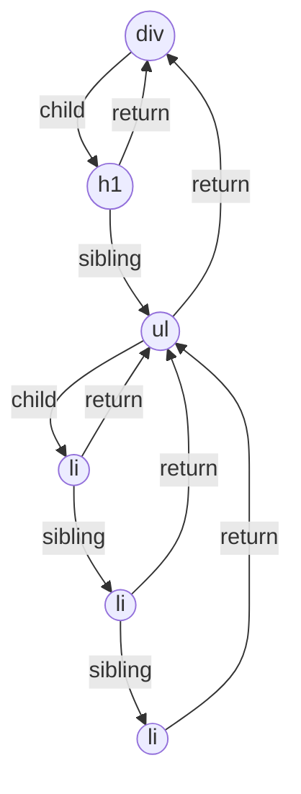

## Prerequisites

1. <a href="/blogs/how-browsers-render-html-and-css" target="_blank" rel="noopener noreferrer" class="underline">How browsers render HTML and CSS</a>
2. React Basics

## Introduction

When you use React, you are using a library that was developed by some of the smartest problem solvers in the world who have been working on it since 2013. They noticed some problems with the technology available at that time and decided to build React.

I have been using React for almost 3 years, but recently, 2 weeks ago, the masculine urge in me decided to become superior to those who don't know the internals of React.

So I started learning React. What was the problem with Angular and jQuery? How it began, reconciliation, diffing, VDOM, Fibre and more.

## Short History

**1990:** We have static web pages, server-rendered, and page navigation means a full page reload

**1995:** JavaScript was created, which means interaction. But lots of code to write to do a simple task.

**2006:** John Resig created jQuery, less code, more work, but scaling was a problem.

**2010:** Google needed large, dynamic web apps, so they created Angular. But <a href="https://www.youtube.com/watch?v=DOWwWsbG1Sw" target="_blank" rel="noopener noreferrer" class="underline">two-way binding</a> caused unpredictable updates, performance issues, hard debugging and a steep learning curve

**2011:** Facebook had a highly dynamic UI, frequent updates(home feed) and a large number of pages. So Jordan Walke created React.

## React

React core idea: UI = f(state) &nbsp;// UI is a function of state change.

You describe how ui should look, and it will manage it by itself, meaning changing the DOM.

No two-way binding, only one-way data flow means predictable updates.

State flows down, and event flows up, simple.

And the main thing was Virtual DOM.

React enabled making DOM updates more efficient, instead of telling the browser how to do it. We now tell what to do; React manages the rest of it.

React minimises unnecessary DOM mutations, which reduces reflow and paint, meaning a performance increase, better & smooth UI.

## Virtual DOM

It's a lightweight tree representation of React elements because comparing JS objects and storing them in memory is way more efficient than mutating the actual DOM.

React changes exactly what we need to be changed and nothing else. When you change a state(clicking a button that increases a counter), React only changes the counter count.

It does so by comparing two VDOMs, before and after, and then it calculates the minimal set of changes to perform.

## Reconciliation

It is a process by which React decides what needs to change.

React creates a tree of elements(VDOM), and the tree is kept in memory. During initial render, there is no way other than to insert the full tree in the DOM.

When the tree changes, React creates a new tree, then React compares the new tree and the old one & find the smallest number of operations to transform one tree into the other using the diffing algorithm.

Generating the minimum number of operations to transform one tree into another has a complexity in the order of O(n3).

So, 1000 elements would require in the order of one billion comparisons.

That's too much

React does in O(n) using a heuristic algorithm based on two assumptions:

1. Two elements of different types will produce different trees.
2. The developer can hint at which child elements may be stable across different renders with a key prop.

### Diffing

Mean comparing two trees. What's the difference between the two trees, old and new(after state change)

 

Now, the problem with the current Reconciliation algorithm(Stack reconciler)

It's recursive, synchronous and uninterruptible

Browsers aim for 60 FPS. 1 frame ≈ 16.67 ms

If JS blocks the main thread longer than that, frames drop, animations stutter, and input feels laggy.

Before Fibre, React could block the main thread for tens or hundreds of ms during large updates.

## Fiber

Introduced and released to the public in September 2017, with the release of React 16.0

The React team completely rewrote the reconciliation algorithm to make the work interruptible so React can pause the work so that the browser can paint the frame, then React continues the work.

The problem was a scheduling problem; the React team figured out how to enhance they should differentiate between low-priority (rendering list) updates & high-priority (user input, animations) updates and giving React the ability to jump between these updates/tasks.

It can partially render a tree without committing to the DOM.

Fibre replaces tree traversal via recursion with a linked structure.

React now represents each node as a Fiber object with pointers like child, sibling, and return (parent)

### 2 Phase process

### 1. Render phase(processing)

It's an asynchronous phase; tasks can be prioritised, work can be paused, or discarded.

React processes one Fiber(unit of work) at a time. After each unit, it checks “Do I still have time before the frame deadline?” If not React yields, Browser paints, React resumes later.

This is called time slicing.

### 2. Commit phase

The synchronous phase cannot be interrupted

Once React decides to commit, DOM mutations happen synchronously. Effects run Layout may occur because the DOM must stay consistent

Partial commits would break correctness, So Fiber only slices render, not commit.

### Example

Typing in a search box while a large list updates:

Before Fiber: Big list re-render components so the input field lags.

With Fiber: Typing update has a higher priority. React pauses list work, handles input, and resumes list later.

 

**Important points to note about Fiber:**

1. Fiber does not make React fast. Fiber makes React interruptible and schedulable.
2. React does not finish every update in 16 ms. React tries not to block the thread longer than a frame.
3. Fiber does not change diffing. Fiber changes how work is scheduled, not diffing rules

 

**That's All**

If you have any doubt, you can ask me on Twitter.

 

**Must Watch**:

1. <a href="https://www.youtube.com/watch?v=ZCuYPiUIONs" target="_blank" rel="noopener noreferrer" class="underline">Lin Clark - A Cartoon Intro to Fiber - React Conf 2017</a>
2. <a href="https://www.youtube.com/watch?v=bvFpe5j9-zQ" target="_blank" rel="noopener noreferrer" class="underline">Sebastian Markbåge - React Performance End to End (React Fiber) - Keynote Part 3 - React Conf 2017</a>
3. <a href="https://www.youtube.com/watch?v=XxVg_s8xAms" target="_blank" rel="noopener noreferrer" class="underline">Introduction to React.js</a>
